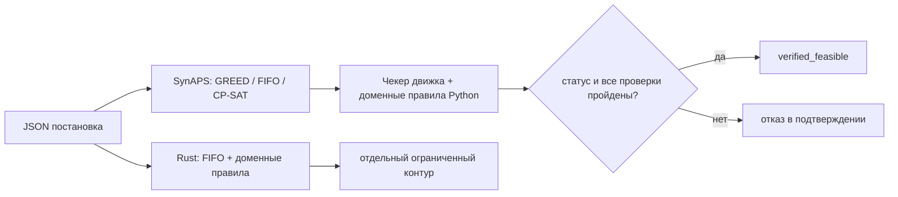

# SynAPS-GridPlan

Воспроизводимое лабораторное ядро планирования работ **ТОиР**: генерация
графика отдельно, независимая проверка отдельно. Бригады, окна отключения,
ЗИП, заморозка согласованных заявок ПЛ и явные запреты «эти два аппарата
не должны быть отключены сразу». Поиск слотов —
[SynAPS](https://github.com/KonkovDV/SynAPS). Проверка правил — отдельный
fail-closed чекер на Python; Rust реализует **доменный** контур с тестами
паритета, но не весь чекер движка SynAPS.

[](https://github.com/KonkovDV/SynAPS-GridPlan/actions/workflows/ci.yml)
[](LICENSE)
[](https://www.python.org/)

Если питч, заявка или этот README расходятся с [docs/LIMITS.md](docs/LIMITS.md)
— верен LIMITS.

| | |
| --- | --- |
| Базовая версия | **0.1.8** [V1] |
| Базовая ветка | `main` |
| Пин SynAPS | [`6178c93`](https://github.com/KonkovDV/SynAPS/commit/6178c93b705ff58be21fa74a98651883a2da1169) [V2] |
| Зрелость | **TRL 4 по ISO 16290: лабораторные фикстуры, не пилот на предприятии** (`versions.py`) [V3]. Не сертификат, **не ГОСТ Р 58048 УГТ4/5**. |
| Счёт pytest | [`docs/TEST_COUNT.txt`](docs/TEST_COUNT.txt) (`python -m pytest --collect-only -q`) [T1] |
| Реестр утверждений | [docs/CLAIMS_REGISTRY.md](docs/CLAIMS_REGISTRY.md) — verified / assumption / target / withdrawn |
| Запрещённые формулировки | [`docs/BANNED_CLAIMS.txt`](docs/BANNED_CLAIMS.txt), CI: `python scripts/lint_claims.py` |
| Границы | [docs/LIMITS.md](docs/LIMITS.md) |
| Пакет подачи | [`SynAPS_GridPlan.pptx`](SynAPS_GridPlan.pptx) (извлечённый текст: [`docs/DECK_TEXT.txt`](docs/DECK_TEXT.txt)) |
| Энерготехнохаб (приём 7–25.09.2026) [P6] | [docs/ETECHHUB_APPLICATION.md](docs/ETECHHUB_APPLICATION.md), страница [etechhubspb.ru/accelerator](https://www.etechhubspb.ru/accelerator) |
| Приз программы | 1 500 000 ₽ — потолок *eligibility* в анонсе СПбПУ, не выплата GridPlan [P8] |
| Одна фраза заявки | [docs/APPLICATION_TOIR_SCENARIO.md](docs/APPLICATION_TOIR_SCENARIO.md) |
| Дек v7 (не отправлять) | [docs/PITCH_V7_FACTCHECK.md](docs/PITCH_V7_FACTCHECK.md) |
| Академия инноваторов, 10-й поток | опубликованный приём до **14.09.2026**; на сверке 18.09 срок прошёл. Не путать с 25.09 Энерготехнохаба. Записка: [ACADEMY_APPLICATION.md](ACADEMY_APPLICATION.md) |
| Исторический пакет другой программы | [APPLICATION.md](APPLICATION.md): марафон «Энергия будущего». PDF 0.1.4: [`_SUBMIT_MIK_2026_08_18/SynAPS-GridPlan-marathon-0.1.4.pdf`](_SUBMIT_MIK_2026_08_18/SynAPS-GridPlan-marathon-0.1.4.pdf) — не пакет подачи |
| Практика | [PRACTICE.md](PRACTICE.md) |
| Аудит | [AUDIT.md](AUDIT.md) |
| УГТ / IP / пилот | [ГОСТ Р 58048](docs/UGT_GOST_R_58048.md), [IP и open-core](docs/IP_AND_OPEN_CORE.md), [one-pager пилота](docs/PILOT_ONEPAGER.md) |
| Автор в git | один: Коньков Д.В. ([CITATION.cff](CITATION.cff)). Предметный эксперт ТОиР в репозитории не назван |

English: crew- and window-constrained maintenance scheduling on SynAPS, with an
independent domain checker. Lab fixtures only. Not N-1, not SAIDI, not a plant
pilot. TRL 4 per ISO 16290: lab fixtures, not a plant pilot. Not GOST R 58048
certification. 187-FZ (KII) compliance is not claimed. ПАО «Россети» is not a
documented GridPlan customer.

## Что открывать на GitHub

| Файл | Зачем |
| --- | --- |
| [`SynAPS_GridPlan.pptx`](SynAPS_GridPlan.pptx) | пакет подачи (14 слайдов) |
| [`benchmark/results/jury_report.md`](benchmark/results/jury_report.md) | FIFO 107 / GREED 0 / CPSAT-30 на одном синтетическом JSON [B1] [B2] [B3] |
| [`docs/LIMITS.md`](docs/LIMITS.md) | границы; приоритет над питчем |
| [`docs/CLAIMS_REGISTRY.md`](docs/CLAIMS_REGISTRY.md) | единственный реестр цифр |
| [`docs/DECK_TEXT.txt`](docs/DECK_TEXT.txt) | текст дека, который диффит CI |

Не пакет подачи: отозванный v7 ([факт-чек](docs/PITCH_V7_FACTCHECK.md)),
архивный PDF марафона в `_SUBMIT_MIK_2026_08_18/`, нумерованный каталог
`docs/00`–`docs/29` (исторические записки, не источник цифр).

CI на `main`: Python 3.12 и 3.13, Rust, lockfile. Гейты: pytest, `lint_claims.py`,
снимок [`docs/TEST_COUNT.txt`](docs/TEST_COUNT.txt) [T1], текст дека,
`jury_report.md` (включая раздел D / CP-SAT), паритет native на `res_severny`.

## Что делает и чего не делает

**Делает.** Назначает бригады на работы при квалификациях, согласованных окнах
отключения, одной единице ЗИП на перечисленную позицию, линейных цепочках
предшественников, замороженных строках ПЛ и явных запретах пары активов.
Второй контур проверки, независимый от поиска, отклоняет план с жёстким
нарушением. В Python принимать результат следует по `outcome.ok`: допустимый
статус, `verified_feasible=true` и ноль жёстких нарушений одновременно.
Поле `schedule.status` само по себе недостаточно.

**Не делает.** Нет модуля трудового права, нет СНиП, нет норм непрерывного
отдыха. Нет SCADA, EMS, GIS, прогноза отказов, N-1 / потокораспределения,
оптимизации SAIDI, ЗИП как BOM-количества, графов предшественников с join /
fan-out, замены ЕАМ / 1С:ТОИР. `Crew.shift_calendar` — окна доступности, не
ростер смен. Оценка риска в отчёте — справочный прокси невыполненных работ,
не измеренное снижение вероятности аварии. Ночные 5k-прогоны ядра SynAPS —
другой домен.



Мировая практика (Hydro-Québec TMS: формализуемые правила отдельно от
power-flow; публичный кейс Hexaly/PosAm/ČEZ — field workforce, другой класс
продукта): [PRACTICE.md](PRACTICE.md). Явный запрет двух отключений не
сертифицирует Tier III. Электрическая безопасность **вне скоупа**. Ни одна
из названных систем не является клиентом, партнёром или внедрением GridPlan.

## Пять минут для жюри

```bash
python -m pip install -e ".[dev]" --force-reinstall
python -m synaps_gridplan version
python benchmark/jury_benchmark.py --cpsat
python scripts/lint_claims.py
python scripts/extract_deck_text.py --check
python scripts/evidence_bundle.py --skip-pytest
```

`version` должен напечатать `0.1.8` и пин `6178c93…`. `jury_benchmark.py --cpsat`
пишет разделы A–D в `benchmark/results/jury_report.md` на **том же**
синтетическом РЭС «Северный». `evidence_bundle.py` без `--skip-pytest`
прогоняет pytest, jury и CP-SAT. JSON пишется в `benchmark/results/`
(gitignore). Не складывать этот прогон с аварийными сутками или scale-фидером.
Время стены в отчёте — машина прогона, не SLA [B7].

| Что увидеть | Команда / файл |
| --- | --- |
| GREED на синтетическом РЭС «Северный» проходит проверку, календарный FIFO — нет | `benchmark/results/jury_report.md` |
| CPSAT-30 на том же JSON: `optimal`, 0 жёстких, dual bound = makespan | тот же отчёт, раздел D; `python benchmark/jury_benchmark.py --cpsat` |
| Fail-closed: GREED на `small --seed 42` пишет план и выходит **2** (`ASSET_OVERLAP`) | блок ниже |
| Тот же маленький фидер, но проверенный | `--seed 12`, exit **0** |
| Текст дека совпадает с git | `python scripts/extract_deck_text.py --check` |
| Мировая практика, без претензии на пилот | `python -m synaps_gridplan practice` |

Демо теперь выходит с кодом 2, если положительные утверждения о GREED,
перепланировании, сохранении заморозки или детерминизме не подтверждены.
Успешное создание Markdown не считается успешным экспериментом.

Если `source` указывает в `site-packages`, а не в `<репо>/src/synaps_gridplan`:

```bash
python -m pip install -e ".[dev]" --force-reinstall --no-deps
```

## Доказательства (синтетика)

| Результат | Где |
| --- | --- |
| [B1] [B2] РЭС «Северный» (55 работ, 7 бригад, 39 активов): FIFO **107** жёстких нарушений, GREED **0** | `tests/test_res_severny.py`, `benchmark/results/jury_report.md` |
| [B3] CP-SAT (`CPSAT-30`) на том же JSON: `optimal`, 0 жёстких, dual bound = makespan. GREED makespan совпал в пределах 1 мин; оптимальность эвристики не утверждается | `test_res_cpsat_proves_optimal_makespan` (маркер `slow`), раздел D `jury_report.md` |
| Перепланирование не двигает замороженные строки ПЛ | Scenario B, те же тесты |
| Native Rust `check` на `res_severny`: доменный паритет kind с Python; `verified_feasible` у native остаётся false, потому что `travel_minutes` непуста | `tests/test_native_parity.py` |
| Блок ГРЭС (синтетика, не станция): GREED чист, FIFO нет | `tests/test_gres_block.py` |
| Два ввода в зал (не М9): GREED чист; оба ввода сразу — `SIMULTANEOUS_OUTAGE_BAN` | `tests/test_dual_feed_hall.py` |
| [B4] Аварийные сутки (23 работы): FIFO 27 / GREED 0 | `tests/test_emergency_day.py`, `benchmark/results/emergency_day_report.md` |
| [B5] Фидер 200 / 600 работ: GREED проверен, FIFO ломает окна | `tests/test_scale_feeder.py`, `benchmark/results/scale_report.md` |
| Чекер ловит overlap, ЗИП, квалификации, короткую длительность | `tests/test_adversarial_*.py` |
| Аудит заморозки, мутаций модели, ID-map, импорта, CSV и UTC | `tests/test_audit_regressions.py`, `tests/test_import_export_audit.py`, `tests/test_time_contract.py`, `tests/test_final_audit_guards.py` |

РЭС «Северный» копирует **типы** оборудования и открытые нормы. Это не
именованный участок Россети и не промышленные данные. Сохранённые отчёты —
снимки прежних запусков, не доказательство результата произвольного commit.

GREED и FIFO — эвристики (`heuristic_feasible`). Доказательство CP-SAT относится
к его модели и целевой функции. Адаптер выбирает одно окно из нескольких;
это не полный поиск по объединению окон и не доказательство глобальной
невыполнимости исходной многовариантной задачи. Все задержки отдельных работ
также нельзя отождествлять с агрегированной tardiness цепочки в SynAPS.

Если жюри спросит, подтверждает ли Rust «ноль» GREED на `res_severny`: доменную
часть — да, слой движка считает Python, `engine_checked=false`. Обе границы
закреплены тестами.

0.1.8 закрывает Red Team 0.1.8–0.1.9: `deque` в `_job_chains`, FIFO
``latest_finish``, заметка об усечении нарушений, overflow в `_cross_refs`.
[Аудит fail-closed вошёл в 0.1.5](https://github.com/KonkovDV/SynAPS-GridPlan/pull/14).
Badge относится к `main`. Доказательства аудита привязаны к commit в `AUDIT.md`,
а не к номеру версии или картинке из дека.

## Установка

Python ≥ 3.12. SynAPS закреплён **коммитом**, не веткой.

```bash
python -m pip install -e ".[dev]" --force-reinstall
python -m synaps_gridplan version
python -m synaps_gridplan practice
python -m pytest -q -m "not slow"
```

## Контракт входа (0.1.8)

- ISO-даты передавайте с `Z` или явным смещением, например
  `2026-09-01T09:00:00+03:00`. Unix-время, boolean и naive datetime без зоны
  отвергаются, в том числе в календарях бригад. Aware-моменты нормализуются в UTC.
- Неизвестные поля верхнего и вложенного GridPlan-документа отвергаются,
  включая native catalogs и лишние ключи календаря бригад. Расширения — только
  в `domain_attributes`. JSON Schema в `schemas/` — конверт верхнего уровня плюс
  вложенный Pydantic-инвентарь; jsonschema проверяет синтетические дампы.
  Это не полная Draft 2020-12-норма произвольного будущего v2 и не байтовый
  round trip.
- ID внутри каталогов уникальны; ссылки должны существовать. Мутации
  `model_copy(update=...)` повторно проверяются на границе компилятора и чекера.
- `immutable:false` не закрепляет слот. Неизменяемую ПЛ нельзя отменить пустым
  списком ожидаемых заморозок или сменой строки в сохранённом плане.
- Пустая `travel_minutes` означает явное допущение нулевого переезда. В непустой
  матрице реальный маршрут A→B не заменяется маршрутом «база→B». Начальные/
  конечные поездки и индивидуальные маршруты при `max_parallel>1` требуют
  отдельного согласования модели; полноценный VRP здесь не заявлен.
- Плотная setup-матрица проверяется до построения по upstream-лимиту
  2 000 000 элементов. Дополнительно действуют лабораторные квоты JSON и
  каталогов (`synaps_gridplan.limits`). Это не SLA CPU/памяти процесса.
- `approved=true`, происхождение данных и TRL — не подпись, не независимая
  проверка источника и не регуляторный допуск.

## Команды

Проверенный демо-стенд жюри (РЭС «Северный», включая CP-SAT):

```bash
python benchmark/jury_benchmark.py --cpsat
```

Маленький фидер, GREED проходит проверку (exit 0):

```bash
python -m synaps_gridplan synthesize --mode small --seed 12 -o feeder.json
python -m synaps_gridplan solve feeder.json --solver GREED -o result.json
python -m synaps_gridplan check feeder.json result.json
python -m synaps_gridplan report result.json --format markdown
```

`report` **не перепроверяет** сохранённый план. Импорт помечается
`imported_snapshot_not_rechecked`. Повторная проверка — `check PROBLEM RESULT`
(`verification_origin=independent_recheck`); сохранённый `verified_feasible`
игнорируется. CSV экранирует формулоподобный текст; JSON не добавляет этих
CSV-префиксов. Интерполяция Markdown сплющивает перевод строки, backticks и
угловые скобки; это не общий HTML-sanitizer. Типизированный рендеринг не
обещает побайтовый JSON round trip. Это не подпись файла.

Fail-closed на том же контуре (`--seed 42` → exit **2**, `ASSET_OVERLAP`):

```bash
python -m synaps_gridplan synthesize --mode small --seed 42 -o feeder.json
python -m synaps_gridplan solve feeder.json --solver GREED -o result.json
```

Это штатная работа продукта, не сломанный install. Native FIFO на том же
seed тоже выходит **2**.

Коды Python CLI:

| Код | Смысл |
| --- | --- |
| **0** | Команда выполнена. Для `solve`/`disrupt`/`check` это также означает подтверждённый план. |
| **2** | План не прошёл проверку либо обработана ошибка аргументов/ввода/вывода. При ошибке входа файл плана может не появиться. |
| **1** | Неперехваченная ошибка или проблема окружения. |

Остальные постановки:

```bash
python benchmark/emergency_day_benchmark.py
python benchmark/scale_benchmark.py
python -m synaps_gridplan synthesize --mode gres-block --seed 42 -o gres.json
python -m synaps_gridplan synthesize --mode dual-feed-hall --seed 42 -o hall.json
```

`gres-block` и `dual-feed-hall` собирает только Python. Native `synthesize`
этих режимов намеренно завершается ошибкой.

Rust: FIFO и доменные проверки, без реализации всего SynAPS engine checker:

```bash
cd native/synaps-gridplan-rs
cargo test --locked
```

Границы и отдельные коды native CLI — в [native README](native/synaps-gridplan-rs/README.md).
Для непустой задачи любая непустая `travel_minutes` блокирует native-подтверждение,
даже если матрица заполнена нулями. Доменный verdict выдаётся отдельно;
`engine_checked=false`. Неподдерживаемое ограничение — не доказанное нарушение
и не сертификат невыполнимости. Не удаляйте реальные переезды ради зелёного флага.
Native `check` не заменяет проверку всех ограничений движка Python.

## Дерево

```
src/synaps_gridplan/        Python-пакет
native/synaps-gridplan-rs/  Rust: FIFO и доменные проверки
schemas/                    JSON Schema (не замена семантической валидации)
benchmark/                  РЭС / jury / аварийные сутки / масштаб
tests/
docs/LIMITS.md              границы продукта
docs/CLAIMS_REGISTRY.md     реестр утверждений
docs/DECK_TEXT.txt          извлечённый текст пакета подачи
docs/TEST_COUNT.txt         снимок pytest --collect-only
SynAPS_GridPlan.pptx        пакет подачи (14 слайдов)
scripts/                    lint_claims, extract_deck_text, evidence_bundle
AUDIT.md                    доказательства аудита и оставшиеся gate
ACADEMY_APPLICATION.md      подготовка к 10-му потоку Академии (срок приёма прошёл)
APPLICATION.md              исторический пакет энергетического марафона
_SUBMIT_MIK_2026_08_18/     архив подачи 18.08.2026; PDF 0.1.4 — не пакет Энерготехнохаба
PRACTICE.md                 мировая практика и границы
CITATION.cff                автор в git
sbom/                       CycloneDX-инвентарь lockfile, не сканер уязвимостей
requirements-lock.txt       Linux-пин Python + SHA SynAPS
```

## Лицензия

MIT — [LICENSE](LICENSE).
