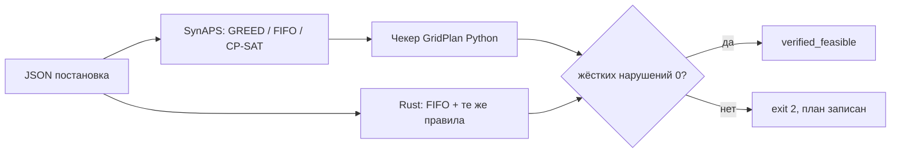

# SynAPS-GridPlan

Планировщик **ТОиР**: бригады, окна отключения, ЗИП, заморозка согласованных
заявок ПЛ и явные запреты «эти два аппарата не должны быть отключены сразу».
Поиск слотов — [SynAPS](https://github.com/KonkovDV/SynAPS). Проверка правил —
отдельный fail-closed чекер на Python и тот же контур на Rust.

[](https://github.com/KonkovDV/SynAPS-GridPlan/actions/workflows/ci.yml)
[](LICENSE)
[](https://www.python.org/)
[](APPLICATION.md)

| | |
| --- | --- |
| Версия | **0.1.4** |
| Ветка | `main` |
| Пин SynAPS | [`6178c93`](https://github.com/KonkovDV/SynAPS/commit/6178c93b705ff58be21fa74a98651883a2da1169) |
| Зрелость | ISO 16290 TRL 4, синтетические фикстуры. **Не пилот на объекте.** |
| Заявка МИК | [APPLICATION.md](APPLICATION.md) · [SynAPS-GridPlan.pdf](SynAPS-GridPlan.pdf) |
| Практика | [PRACTICE.md](PRACTICE.md) |

English: crew- and window-constrained maintenance scheduling on SynAPS, with an
independent checker. Lab fixtures only. Not N-1, not SAIDI, not a plant pilot.

## Что делает и чего не делает

**Делает.** Назначает бригады на работы при квалификациях, согласованных окнах
отключения, одной единице ЗИП на перечисленную позицию, линейных цепочках
предшественников, замороженных строках ПЛ и явных запретах пары активов.
Второй контур проверки, независимый от поиска, отклоняет план с жёстким
нарушением. `FEASIBLE` ⇒ жёстких нарушений нет.

**Не делает.** SCADA, EMS, GIS, прогноз отказов, N-1 / потокораспределение,
оптимизацию SAIDI, ЗИП как BOM-количество, графы предшественников с join /
fan-out, замену ЕАМ / 1С:ТОИР. Оценка риска в отчёте — справочный прокси,
не движок надёжности. Ночные 5k-прогоны ядра SynAPS — другой домен.



Мировая практика (Hydro-Québec TMS: формализуемые правила отдельно от
power-flow; Uptime Tier III как запрет занять оба ввода): [PRACTICE.md](PRACTICE.md).
Электрическая безопасность **вне скоупа**.

## Пять минут для жюри

```bash
python -m pip install -e ".[dev]" --force-reinstall
python -m synaps_gridplan version
python benchmark/jury_benchmark.py
```

| Что увидеть | Команда / файл |
| --- | --- |
| GREED на синтетическом РЭС «Северный» проходит проверку, календарный FIFO — нет | `benchmark/results/jury_report.md` |
| Fail-closed: GREED на `small --seed 42` пишет план и выходит **2** (`ASSET_OVERLAP`) | блок ниже |
| Тот же маленький фидер, но проверенный | `--seed 12`, exit **0** |
| Мировая практика, без претензии на пилот | `python -m synaps_gridplan practice` |

`version` должен напечатать `0.1.4` и пин `6178c93…`. Если `source` указывает
в `site-packages`, а не в `<репо>/src/synaps_gridplan`:

```bash
python -m pip install -e ".[dev]" --force-reinstall --no-deps
```

## Доказательства (синтетика)

| Результат | Где |
| --- | --- |
| РЭС «Северный» (55 работ): GREED проверен, FIFO нет | `tests/test_res_severny.py`, `benchmark/results/jury_report.md` |
| CP-SAT доказывает оптимум makespan (dual bound = факт) | `test_res_cpsat_proves_optimal_makespan` (маркер `slow`) |
| Перепланирование не двигает замороженные строки ПЛ | Scenario B, те же тесты |
| Блок ГРЭС (синтетика, не станция): GREED чист, FIFO нет | `tests/test_gres_block.py` |
| Два ввода в зал (не М9): GREED чист; оба ввода сразу — `SIMULTANEOUS_OUTAGE_BAN` | `tests/test_dual_feed_hall.py` |
| Аварийные сутки (узел «Восточный», СТО 17330282 / приказ № 289): GREED чист, FIFO 27 нарушений, заморозка ПЛ жива | `tests/test_emergency_day.py`, `benchmark/results/emergency_day_report.md` |
| Фидер 200 / 600 работ: GREED проверен, FIFO ломает окна | `tests/test_scale_feeder.py`, `benchmark/results/scale_report.md` |
| Чекер ловит overlap, ЗИП, квалификации, короткую длительность | `tests/test_adversarial_*.py` |

РЭС «Северный» копирует **типы** оборудования и открытые нормы. Это не
именованный участок Россети и не промышленные данные.

GREED и FIFO — эвристики (`heuristic_feasible`). `optimal` может сказать только
CP-SAT, и только когда dual bound совпал с фактом.

## Установка

Python ≥ 3.12. SynAPS закреплён **коммитом**, не веткой.

```bash
python -m pip install -e ".[dev]" --force-reinstall
python -m synaps_gridplan version
python -m synaps_gridplan practice
python -m pytest -q -m "not slow"
```

## Команды

Проверенный демо-стенд жюри (РЭС «Северный»):

```bash
python benchmark/jury_benchmark.py
```

Маленький фидер, GREED проходит проверку (exit 0):

```bash
python -m synaps_gridplan synthesize --mode small --seed 12 -o feeder.json
python -m synaps_gridplan solve feeder.json --solver GREED -o result.json
python -m synaps_gridplan report result.json --format markdown
```

Fail-closed на том же контуре (`--seed 42` → exit **2**, `ASSET_OVERLAP`):

```bash
python -m synaps_gridplan synthesize --mode small --seed 42 -o feeder.json
python -m synaps_gridplan solve feeder.json --solver GREED -o result.json
```

Это штатная работа продукта, не сломанный install. Native FIFO на том же
seed тоже выходит **2**.

| Код | Смысл |
| --- | --- |
| **0** | `verified_feasible=true`, жёстких нарушений 0 |
| **2** | план записан, независимый чекер нашёл жёсткие нарушения |
| **1** | ошибка запуска / ввода |

Остальные постановки:

```bash
python benchmark/emergency_day_benchmark.py
python benchmark/scale_benchmark.py
python -m synaps_gridplan synthesize --mode gres-block --seed 42 -o gres.json
python -m synaps_gridplan synthesize --mode dual-feed-hall --seed 42 -o hall.json
```

`gres-block` и `dual-feed-hall` собирает только Python. Native `synthesize`
этих режимов намеренно завершается ошибкой.

Rust-чекер (FIFO + те же правила, без GREED):

```bash
cd native/synaps-gridplan-rs
cargo test
```

## Дерево

```
src/synaps_gridplan/        Python-пакет
native/synaps-gridplan-rs/  Rust: FIFO и проверки
schemas/                    JSON Schema
benchmark/                  РЭС / jury / аварийные сутки / масштаб
tests/
APPLICATION.md              заявка МИК
PRACTICE.md                 мировая практика и честные границы
SynAPS-GridPlan.pdf         22 слайда (рус.)
requirements-lock.txt       Linux-пин Python + SHA SynAPS
```

## Лицензия

MIT — [LICENSE](LICENSE).
