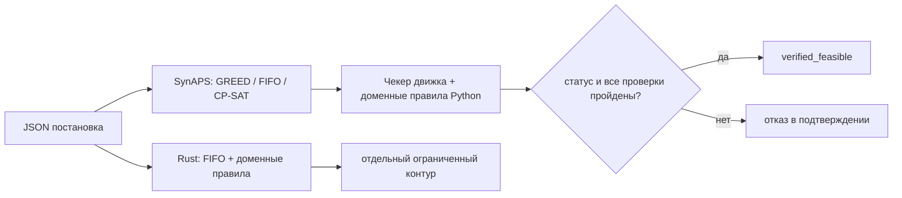

# SynAPS-GridPlan

Планировщик **ТОиР**: бригады, окна отключения, ЗИП, заморозка согласованных
заявок ПЛ и явные запреты «эти два аппарата не должны быть отключены сразу».
Поиск слотов — [SynAPS](https://github.com/KonkovDV/SynAPS). Проверка правил —
отдельный fail-closed чекер на Python; Rust реализует доменный контур
с целевыми тестами паритета, **но не весь чекер движка SynAPS**.

[](https://github.com/KonkovDV/SynAPS-GridPlan/actions/workflows/ci.yml)
[](LICENSE)
[](https://www.python.org/)

| | |
| --- | --- |
| Базовая версия | **0.1.4**; нерелизные исправления аудита — в PR ниже |
| Базовая ветка | `main` |
| Пин SynAPS | [`6178c93`](https://github.com/KonkovDV/SynAPS/commit/6178c93b705ff58be21fa74a98651883a2da1169) |
| Зрелость | **Самооценка** ISO 16290 TRL 4, синтетические фикстуры. Не сертификат и **не пилот на объекте**. |
| Академия инноваторов, 10-й поток | [Подготовка заявки и проверенные условия](ACADEMY_APPLICATION.md) |
| Исторический пакет другой программы | [APPLICATION.md](APPLICATION.md): «Марафон инноваций. Энергия будущего». PDF ещё не актуализирован для Академии. |
| Практика | [PRACTICE.md](PRACTICE.md) |
| Аудит и риски | [AUDIT.md](AUDIT.md): воспроизведения, CI, границы модели и выпускной gate |

[Аудит и исправления — PR #12](https://github.com/KonkovDV/SynAPS-GridPlan/pull/12).
Badge выше относится к `main`; актуальность аудита проверяйте по Checks PR
и точному commit, а не по номеру версии или старой картинке отчёта.

English: crew- and window-constrained maintenance scheduling on SynAPS, with an
independent domain checker. Lab fixtures only. Not N-1, not SAIDI, not a plant pilot.

## Что делает и чего не делает

**Делает.** Назначает бригады на работы при квалификациях, согласованных окнах
отключения, одной единице ЗИП на перечисленную позицию, линейных цепочках
предшественников, замороженных строках ПЛ и явных запретах пары активов.
Второй контур проверки, независимый от поиска, отклоняет план с жёстким
нарушением. В Python принимать результат следует по `outcome.ok`: допустимый
статус, `verified_feasible=true` и ноль жёстких нарушений одновременно.
Поле `schedule.status` само по себе недостаточно.

**Не делает.** SCADA, EMS, GIS, прогноз отказов, N-1 / потокораспределение,
оптимизацию SAIDI, ЗИП как BOM-количество, графы предшественников с join /
fan-out, замену ЕАМ / 1С:ТОИР. Оценка риска в отчёте — справочный прокси
невыполненных работ, не измеренное снижение вероятности аварии.
Ночные 5k-прогоны ядра SynAPS — другой домен.



Мировая практика (Hydro-Québec TMS: формализуемые правила отдельно от
power-flow): [PRACTICE.md](PRACTICE.md). Явный запрет двух отключений не
сертифицирует Tier III. Электрическая безопасность **вне скоупа**.

## Пять минут для жюри

```bash
python -m pip install -e ".[dev]" --force-reinstall
python -m synaps_gridplan version
python benchmark/jury_benchmark.py
```

| Что увидеть | Команда / файл |
| --- | --- |
| GREED на синтетическом РЭС «Северный» проходит проверку, календарный FIFO — нет | `benchmark/results/jury_report.md` |
| Fail-closed: GREED на `small --seed 42` пишет план и выходит **2** (`ASSET_OVERLAP`) | блок ниже |
| Тот же маленький фидер, но проверенный | `--seed 12`, exit **0** |
| Мировая практика, без претензии на пилот | `python -m synaps_gridplan practice` |

Демо теперь выходит с кодом 2, если положительные утверждения о GREED,
перепланировании, сохранении заморозки или детерминизме не подтверждены.
Успешное создание Markdown не считается успешным экспериментом.

`version` должен напечатать `0.1.4` и пин `6178c93…`. Если `source` указывает
в `site-packages`, а не в `<репо>/src/synaps_gridplan`:

```bash
python -m pip install -e ".[dev]" --force-reinstall --no-deps
```

## Доказательства (синтетика)

| Результат | Где |
| --- | --- |
| РЭС «Северный» (55 работ): GREED проверен, FIFO нет | `tests/test_res_severny.py`, `benchmark/results/jury_report.md` |
| CP-SAT доказывает оптимум makespan скомпилированной постановки | `test_res_cpsat_proves_optimal_makespan` (маркер `slow`) |
| Перепланирование не двигает замороженные строки ПЛ | Scenario B, те же тесты |
| Блок ГРЭС (синтетика, не станция): GREED чист, FIFO нет | `tests/test_gres_block.py` |
| Два ввода в зал (не М9): GREED чист; оба ввода сразу — `SIMULTANEOUS_OUTAGE_BAN` | `tests/test_dual_feed_hall.py` |
| Аварийные сутки: синтетическая постановка с отдельными проверками ограничений | `tests/test_emergency_day.py`, `benchmark/results/emergency_day_report.md` |
| Фидер 200 / 600 работ: GREED проверен, FIFO ломает окна | `tests/test_scale_feeder.py`, `benchmark/results/scale_report.md` |
| Чекер ловит overlap, ЗИП, квалификации, короткую длительность | `tests/test_adversarial_*.py` |
| Аудит заморозки, мутаций модели, ID-map, импорта, CSV и UTC | `tests/test_audit_regressions.py`, `tests/test_import_export_audit.py`, `tests/test_time_contract.py`, `tests/test_final_audit_guards.py` |

РЭС «Северный» копирует **типы** оборудования и открытые нормы. Это не
именованный участок Россети и не промышленные данные. Сохранённые отчёты —
снимки прежних запусков, не доказательство результата произвольного commit.

GREED и FIFO — эвристики (`heuristic_feasible`). Доказательство CP-SAT относится
к его модели и целевой функции. Адаптер выбирает одно окно из нескольких;
это не полный поиск по объединению окон и не доказательство глобальной
невыполнимости исходной многовариантной задачи. Все задержки отдельных работ
также нельзя отождествлять с агрегированной tardiness цепочки в SynAPS.

## Установка

Python ≥ 3.12. SynAPS закреплён **коммитом**, не веткой.

```bash
python -m pip install -e ".[dev]" --force-reinstall
python -m synaps_gridplan version
python -m synaps_gridplan practice
python -m pytest -q -m "not slow"
```

## Контракт входа после аудита

- ISO-даты передавайте с `Z` или явным смещением, например
  `2026-09-01T09:00:00+03:00`. Распознанные aware-моменты доменной модели
  нормализуются в UTC. Naive datetime без зоны отвергаются.
  Pydantic-коэрции остаются: это не строгий ISO-only JSON Schema-контракт.
- ID внутри каталогов уникальны; ссылки должны существовать. Мутации
  `model_copy(update=...)` повторно проверяются на границе компилятора и чекера.
- `immutable:false` не закрепляет слот. Неизменяемую ПЛ нельзя отменить пустым
  списком ожидаемых заморозок или сменой строки в сохранённом плане.
- Пустая `travel_minutes` означает явное допущение нулевого переезда. В непустой
  матрице реальный маршрут A→B не заменяется маршрутом «база→B». Начальные/
  конечные поездки и индивидуальные маршруты при `max_parallel>1` требуют
  отдельного согласования модели; полноценный VRP здесь не заявлен.
- Плотная setup-матрица проверяется до построения по upstream-лимиту
  2 000 000 элементов. Это не полный бюджет JSON, CPU и памяти всего процесса.
- `approved=true`, происхождение данных и TRL — не подпись, не независимая
  проверка источника и не регуляторный допуск.

## Команды

Проверенный демо-стенд жюри (РЭС «Северный»):

```bash
python benchmark/jury_benchmark.py
```

Маленький фидер, GREED проходит проверку (exit 0):

```bash
python -m synaps_gridplan synthesize --mode small --seed 12 -o feeder.json
python -m synaps_gridplan solve feeder.json --solver GREED -o result.json
python -m synaps_gridplan report result.json --format markdown
```

`report` **не перепроверяет** сохранённый план. Импорт помечается
`imported_snapshot_not_rechecked`. CSV экранирует формулоподобный текст;
JSON не добавляет этих CSV-префиксов. Типизированный рендеринг не обещает
побайтовый JSON round trip. Это не подпись файла.

Fail-closed на том же контуре (`--seed 42` → exit **2**, `ASSET_OVERLAP`):

```bash
python -m synaps_gridplan synthesize --mode small --seed 42 -o feeder.json
python -m synaps_gridplan solve feeder.json --solver GREED -o result.json
```

Это штатная работа продукта, не сломанный install. Native FIFO на том же
seed тоже выходит **2**.

Коды Python CLI:

| Код | Смысл |
| --- | --- |
| **0** | Команда выполнена. Только для `solve`/`disrupt` это также означает подтверждённый план. |
| **2** | План не прошёл проверку либо обработана ошибка аргументов/ввода/вывода. При ошибке входа файл плана может не появиться. |
| **1** | Неперехваченная ошибка или проблема окружения. |

Остальные постановки:

```bash
python benchmark/emergency_day_benchmark.py
python benchmark/scale_benchmark.py
python -m synaps_gridplan synthesize --mode gres-block --seed 42 -o gres.json
python -m synaps_gridplan synthesize --mode dual-feed-hall --seed 42 -o hall.json
```

`gres-block` и `dual-feed-hall` собирает только Python. Native `synthesize`
этих режимов намеренно завершается ошибкой.

Rust: FIFO и доменные проверки, без реализации всего SynAPS engine checker:

```bash
cd native/synaps-gridplan-rs
cargo test --locked
```

Границы и отдельные коды native CLI — в [native README](native/synaps-gridplan-rs/README.md).
Для непустой задачи любая непустая `travel_minutes` блокирует native-подтверждение,
даже если матрица заполнена нулями. Доменный verdict выдаётся отдельно;
`engine_checked=false`. Неподдерживаемое ограничение — не доказанное нарушение
и не сертификат невыполнимости. Не удаляйте реальные переезды ради зелёного флага.
Native `check` не заменяет проверку всех ограничений движка Python.

## Дерево

```
src/synaps_gridplan/        Python-пакет
native/synaps-gridplan-rs/  Rust: FIFO и доменные проверки
schemas/                    JSON Schema (не замена семантической валидации)
benchmark/                  РЭС / jury / аварийные сутки / масштаб
tests/
AUDIT.md                    доказательства аудита, границы и выпускной gate
ACADEMY_APPLICATION.md      подготовка к 10-му потоку Академии
APPLICATION.md              исторический пакет энергетического марафона
PRACTICE.md                 мировая практика и границы
SynAPS-GridPlan.pdf         прежняя презентация; не обновлена этим аудитом
requirements-lock.txt       Linux-пин Python + SHA SynAPS
```

## Лицензия

MIT — [LICENSE](LICENSE).
